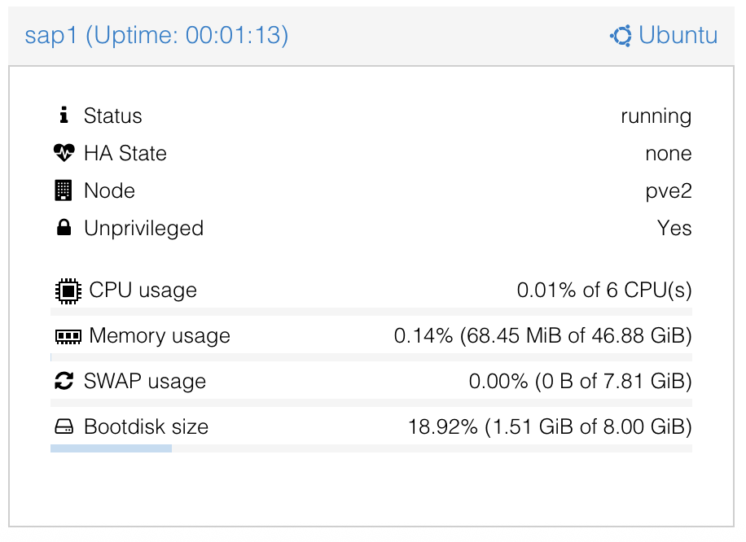

##########################
  Run SAP as a Container
##########################

I will be using Proxmox as hypervisor.

Proxmox natively suports LXC containers.
To run Docker containers I will create a container template with needed packages (primarily ``curl`` and ``docker``).

Proxmox
=======

Create a container template
---------------------------

Download latest Ubuntu LTS (2404.2-2).

Do the usual post-install housekeeping chores.

.. code:: bash

  apt update && apt dist-upgrade -y

Install Docker
--------------

As both Ubuntu and RaspberryOS are based on Debian scripts can be quite similar.
Follow:
https://raspberrytips.com/docker-compose-raspberry-pi/
to install Docker and lean about related useful topics.

Install Curl

.. code:: bash

  apt install curl

Install Docker

.. code:: bash

  curl -sSL https://get.docker.com | sh

  systemctl status docker

  docker --version

Add user
--------

Add password and the rest can be blanks (press return multiple times).

.. code:: bash

  adduser ve

Add to sudo group

.. code:: bash

  adduser ve sudo

.. code:: bash

  adduser ve docker

Verify...

.. code:: bash

  groups ve

Expected result is: :code:`ve : ve sudo users docker`.

Login as :code:`ve` (or use :code:`su`):

.. code:: bash

Disable (lock) root account 

.. code:: bash

  sudo passwd -l root

You will now have to login as :code:`ve` and use :code:`sudo`.

SAP
===

https://community.sap.com/t5/technology-blogs-by-sap/abap-cloud-developer-trial-2022-available-now/ba-p/13598069

https://community.sap.com/t5/enterprise-resource-planning-blogs-by-sap/containerizing-sap-s-4hana-systems-with-docker/ba-p/13581243

Downloading Docker image
------------------------

.. code:: bash

  sudo docker pull sapse/abap-cloud-developer-trial:ABAPTRIAL_2022_SP01

Note: You need to include a tag as :code:`:latest` is not supported.

This will take a *long* while as it will download ~56GB.
If you are on a slow connection, you should check your power settings so your workstation does not go to hibernate mode.

.. image:: ./media/docker_pull.png
  :align: left
  :width: 700 px

If you see "disk quota exceeded"

.. image:: ./media/disk_quota_exceeded.png
  :align: left
  :width: 740 px

This can also be seen in the summary tile:

.. image:: ./media/cli_df.png
  :align: left
  :width: 600 px

You can resize and run again.

.. code:: bash

  pct resize 100 rootfs 100G

The :code:`docker pull` have used up approximately 54GB

.. image:: ./media/cli_df_after_pull.png
  :align: left
  :width: 560 px

You can verify

.. image:: ./media/docker_images.png
  :align: left
  :width: 800 px

Cite:

  ABAP Cloud Developer Trial is a free, downloadable ABAP Platform on SAP HANA 2.0 for trying out the ABAP language and toolset. It is extensively pre-configured with SAP Fiori launchpad, SAP Cloud Connector, pre-configured backend /frontend connections, roles, and sample applications.

Docker Hub
----------

https://hub.docker.com/r/sapse/abap-cloud-developer-trial

Requirements
------------

Requirements from SAP:

- 32GB for image
- 16GB for Docker itself

These are not enough

*********
  Notes
*********

Docker Desktop 
==============

#. Docker Desktop is a *licensed* product, and is *not* IBM compliant.
#. Docker CLI and various tools are FOSS -- still; please observe the licenses.
#. I will only use Docker CLI as it gives me the most freedom and options (and... it is the only option while inside a container).

