##########################
  Run SAP as a Container
##########################

The main components are:

- Docker CLI and runtime
- SAP Docker Image

*******
  SAP
*******

About
=====

  ABAP Cloud Developer Trial is a free, downloadable ABAP Platform on SAP HANA 2.0 
  for trying out the ABAP language and toolset. 
  It is extensively pre-configured with SAP Fiori launchpad, SAP Cloud Connector, 
  pre-configured backend /frontend connections, roles, and sample applications.

The SAP container and setup is documented here:

- `ABAP Cloud Developer Trial 2022 Available Now <https://community.sap.com/t5/technology-blogs-by-sap/abap-cloud-developer-trial-2022-available-now/ba-p/13598069>`__
- `Containerizing SAP S/4HANA Systems with Docker <https://community.sap.com/t5/enterprise-resource-planning-blogs-by-sap/containerizing-sap-s-4hana-systems-with-docker/ba-p/13581243>`__

The SAP Docker image is Intel based and community supported.
If you are using a M-series Apple processor you must use an emulator: 
`M-series Apple Chip MacBooks and Abap Platform Trial containers using Docker and Podman <https://community.sap.com/t5/technology-blog-posts-by-members/m-series-apple-chip-macbooks-and-abap-platform-trial-containers-using/ba-p/13593215>`__.
More documentation can be found on `Docker Hub <https://hub.docker.com/r/sapse/abap-cloud-developer-trial>`__.

Requirements
============

From Docker Hub:
`sapse/abap-cloud-developer-trial <https://hub.docker.com/r/sapse/abap-cloud-developer-trial>`__. 

  Please note: We highly recommend 32GB RAM to run the ABAP Platform Trial image. 
  The following requirements only cover the resources needed for the Docker environment itself.

Linux
-----

- 4 CPUs
- 16GB RAM
- 150GB Disk

The documentation also mentions macOS requirements.

**********
  Docker
**********
 
Everything related to Docker will be accessed through the CLI.

You can verify by creating a https://httpbin.org/ container

.. code:: bash

  docker run -p 80:80 kennethreitz/httpbin

Specifically for httpbin you can enter the container,
and determine the IP address by calling :code:`ip a`.
Now open a browser with port :code:`80` (see run above).

The ABAP trial does not have :code:`ip` installed so the IP address in determined in another way (see later).

Download (pull) SAP Docker Image
================================

.. code:: bash

  sudo docker pull sapse/abap-cloud-developer-trial:ABAPTRIAL_2022_SP01

The image was recently updated (and disk requirement was bumped 150->170GB).

.. code:: bash

  sudo docker pull sapse/abap-cloud-developer-trial:2023

.. image:: ./media/docker_images_2023.png
  :align: left
  :width: 840 px

To get rid of the image tagged :code:`ABAPTRIAL_2022_SP01`,
find the IMAGE ID (:code:`ea090f8a6120`) and run the following command:

.. code:: bash

  docker image rm ea090f8a6120

When pulling you *must* include a tag as :code:`:latest` is not supported by ABAP Trial (not all Docker images has this constraint).

This can take a *long* time as the :code:`docker pull` will download and extract ~58GB.
If you are on a slow connection, you should check your power settings,
so your workstation does not risk going to hibernate mode due to inaction.

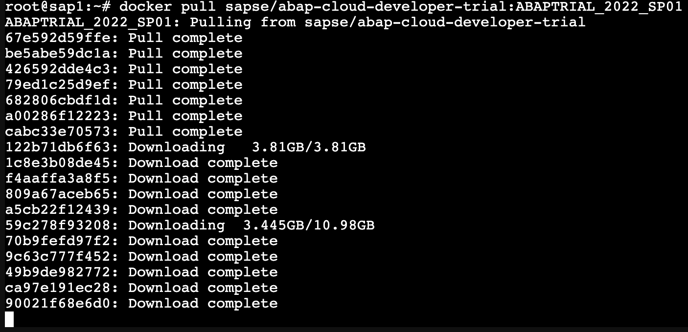

If you see "disk quota exceeded" (this screenshot is from a 8GB LXC container hosting Docker).

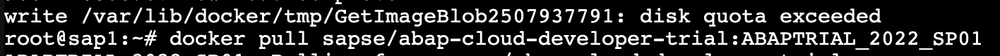

And also be seen in the filesystem.

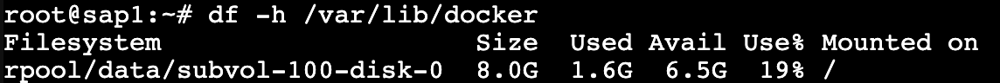

You will need more disk space and run the :code:`docker pull` again.

The SAP recommendation for the contaimer is minimum 170GB, 
and you can resize while the container is running.

The :code:`docker pull` have used up approximately 54GB disk space.

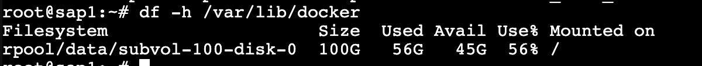

You can verify

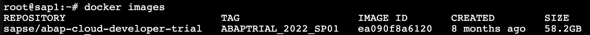

And used Docker system resources more generally

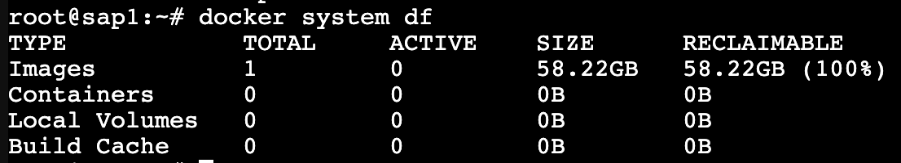

Running the Docker Image
========================

From https://hub.docker.com/r/sapse/abap-cloud-developer-trial::
  
  docker run --stop-timeout 3600 -i --name a4h -h vhcala4hci -p 3200:3200 -p 3300:3300 -p 8443:8443 -p 30213:30213 -p 50000:50000 -p 50001:50001 sapse/abap-cloud-developer-trial:<TAGNAME> -skip-limits-check

The following changes should be made:

- :code:`<TAGNAME>` should be replaced with :code:`2023`
- add :code:`-agree-to-sap-license`
- add :code:`--sysctl kernel.shmmni=32768` to remove a limit nag

.. code:: bash
  
  docker run --stop-timeout 3600 -i --name a4h -h vhcala4hci -p 3200:3200 -p 3300:3300 -p 8443:8443 -p 30213:30213 -p 50000:50000 -p 50001:50001 sapse/abap-cloud-developer-trial:2023 -skip-limits-check -agree-to-sap-license

Then the container will start.

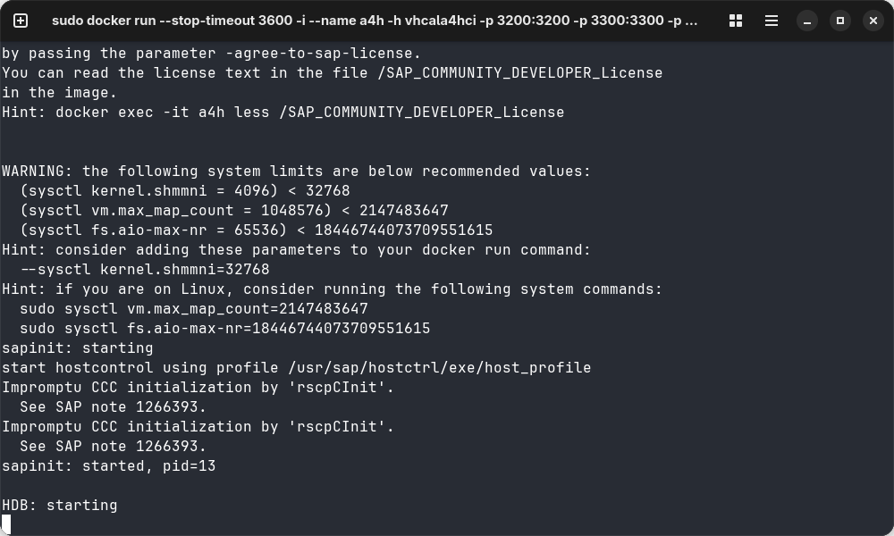

It will take some minuttes to complete spooling up.

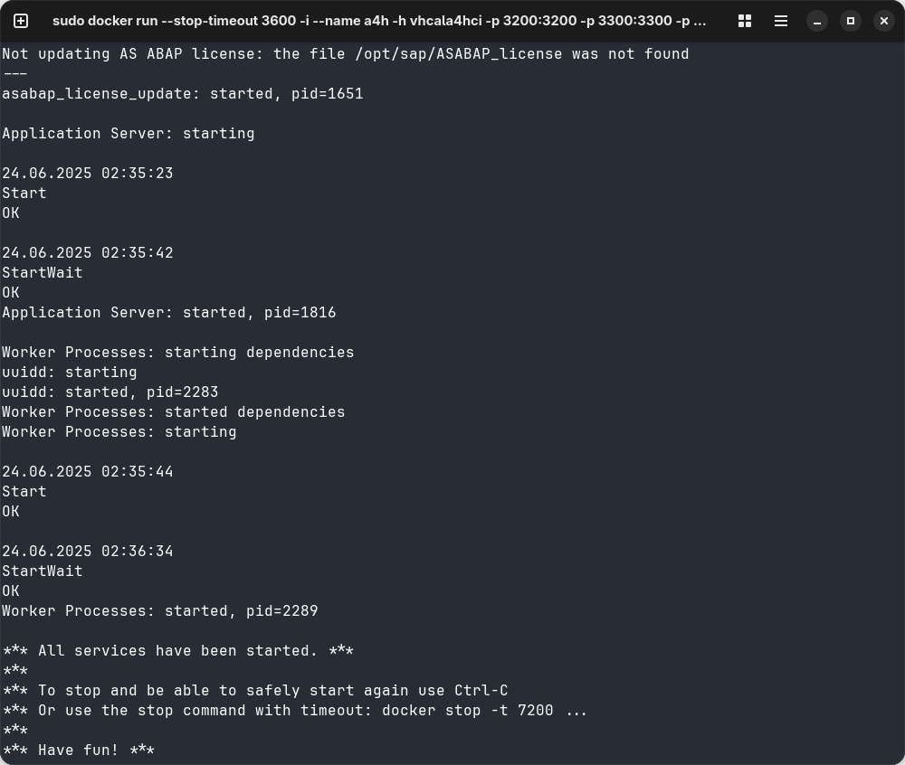

Locate the container's GUID (can name be used?)

.. code:: bash
  
  docker container ps

Inspect the container and take note of network.

.. code:: bash

  docker container inspect e1c6f14897bf

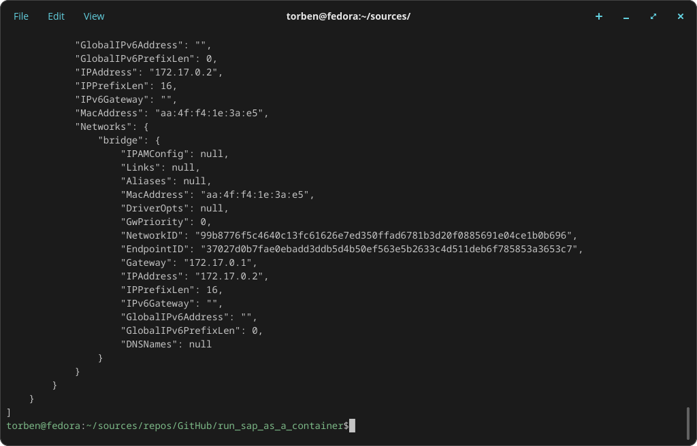

IP address is :code:`172.17.0.2`

To verify the server is responding.
Open a browser pointing to :code:`https://172.17.0.2:50001/`. (the port number depends on protocol http/https).

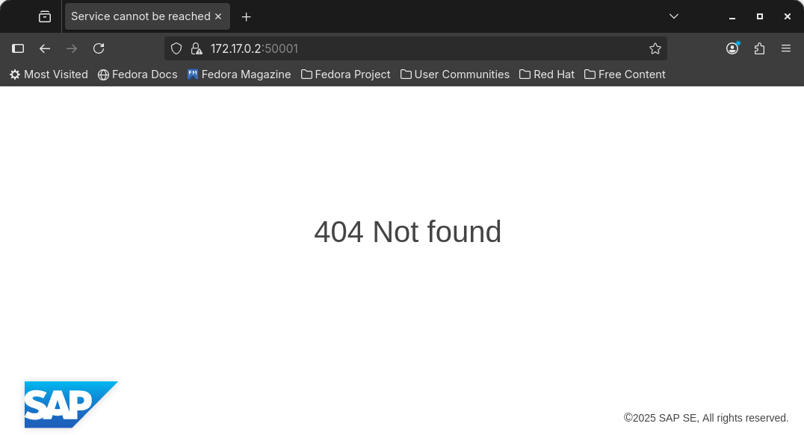

**SUCCESS**

When stopping wait ---

make stop ?

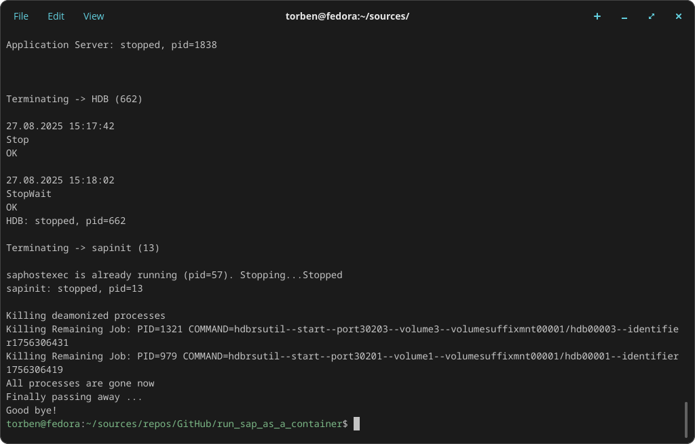

**********
  Client
**********

TODO 

You can access the server using  abrowser or SAP GUI (Business Client?) TODO

To download a current version of the BC you need an s-user with the proper download permissions and also accept the terms.

You an alternatively download an (old) version.

.. code:: bash

  java -jar PlatinGUI-MacOSX-arm64-7.80rev7.jar

The Java version does not run on current versions of Java 1.8 so you so can choose to containerize it.
*There is a dependency on X11*,

https://github.com/thalesvb/docker-platingui

.. code:: bash

  java -jar PlatinGUI-MacOSX-arm64-7.80rev7.jar

*********
  Notes
*********

Docker Desktop 
==============

#. Docker Desktop is a *licensed* product, with a free tier for personal use; observe the license.
#. Docker CLI and various tools are FOSS -- still; please observe the licenses.
#. I will only use Docker CLI as it gives me the most freedom and options (and... it is the simplest option while inside a container).

************
  Makefile
************

