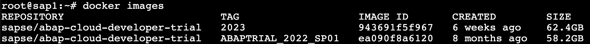

##########################
  Run SAP as a Container
##########################

The main components are:

- Proxmox LXC Container
- Docker CLI and runtime
- SAP Docker Image

***********
  Proxmox
***********

I will be using `Proxmox VE <https://www.proxmox.com/>`__ as hypervisor.

Proxmox natively supports `LXC <https://en.wikipedia.org/wiki/LXC>`__ containers (*not* Docker).
A comparison is available here: https://www.docker.com/blog/lxc-vs-docker/.

To run a Docker container I will use a prepared
LXC `container <https://github.com/TorbenJakobsen/run-docker-in-proxmox-lxc-container>`__
with needed packages (``curl`` and ``docker``).

*******
  SAP
*******

About
=====

  ABAP Cloud Developer Trial is a free, downloadable ABAP Platform on SAP HANA 2.0 
  for trying out the ABAP language and toolset. 
  It is extensively pre-configured with SAP Fiori launchpad, SAP Cloud Connector, 
  pre-configured backend /frontend connections, roles, and sample applications.

The SAP container and setup is documented here:

- `ABAP Cloud Developer Trial 2022 Available Now <https://community.sap.com/t5/technology-blogs-by-sap/abap-cloud-developer-trial-2022-available-now/ba-p/13598069>`__
- `Containerizing SAP S/4HANA Systems with Docker <https://community.sap.com/t5/enterprise-resource-planning-blogs-by-sap/containerizing-sap-s-4hana-systems-with-docker/ba-p/13581243>`__

The SAP Docker image is Intel based and community supported.
If you are using a M-series Apple processor you must use an emulator: 
`M-series Apple Chip MacBooks and Abap Platform Trial containers using Docker and Podman <https://community.sap.com/t5/technology-blog-posts-by-members/m-series-apple-chip-macbooks-and-abap-platform-trial-containers-using/ba-p/13593215>`__.
More documentation can be found on `Docker Hub <https://hub.docker.com/r/sapse/abap-cloud-developer-trial>`__.

Requirements
============

From Docker Hub:
`sapse/abap-cloud-developer-trial <https://hub.docker.com/r/sapse/abap-cloud-developer-trial>`__. 

Please note: We highly recommend 32GB RAM to run the ABAP Platform Trial image. 
The following requirements only cover the resources needed for the Docker environment itself.

Linux
-----

- 4 CPUs
- 16GB RAM
- 170GB Disk

The documentation also mentions macOS requirements.

LXC Container
=============

The container has been created with:

- 6 CPUs
- 48GB RAM
- 8GB Swap
- 200GB Disk

The following screenshot is after the Docker image was pulled.

**********
  Docker
**********
 
Everything related to Docker will be accessed through the CLI.

You can verify by creating a https://httpbin.org/ container

.. code:: bash

  docker run -p 80:80 kennethreitz/httpbin

Determine the IP address by calling :code:`ip a` and opening a browser with port 80 (see above run)

Download SAP Image
=====================

.. code:: bash

  sudo docker pull sapse/abap-cloud-developer-trial:ABAPTRIAL_2022_SP01

The image was recently updated (and disk requirement was bumped 150->170GB).

.. code:: bash

  sudo docker pull sapse/abap-cloud-developer-trial:2023

To get rid of the image tagged :code:`ABAPTRIAL_2022_SP01`,
find the IMAGE ID (:code:`ea090f8a6120`) and run the following command:

.. code:: bash

  docker image rm ea090f8a6120

When pulling you *must* include a tag as :code:`:latest` is not supported.

This can take a *long* time as the :code:`docker pull` will download and extract ~58GB.
If you are on a slow connection, you should check your power settings,
so your workstation does not risk going to hibernate mode due to inaction.

.. image:: ./media/docker_pull.png
  :align: left
  :width: 700 px

If you see "disk quota exceeded" (here the LXC container was not resized from 8GB to 200GB).

.. image:: ./media/disk_quota_exceeded.png
  :align: left
  :width: 740 px

This can be seen in the summary tile:

.. image:: ./media/ct_tile.png
  :align: left
  :width: 460 px

And also be seen in the filesystem.

.. image:: ./media/cli_df.png
  :align: left
  :width: 580 px

You can resize and run the :code:`docker pull` again.

.. code:: bash

  pct resize 100 rootfs 100G

Just for reference. Here is how to add to a VM:

.. code:: bash

  pct resize 101 scsi0 +30G

The SAP recommendation for the contaimer is minimum 170GB, 
and you can resize while the container is running.

The :code:`docker pull` have used up approximately 54GB disk space.

.. image:: ./media/cli_df_after_pull.png
  :align: left
  :width: 560 px

You can verify

.. image:: ./media/docker_images.png
  :align: left
  :width: 800 px

And used Docker system resources more generally

.. image:: ./media/docker_system_df.png
  :align: left
  :width: 500 px

Running the Docke Image
=======================

From https://hub.docker.com/r/sapse/abap-cloud-developer-trial::
  
  docker run --stop-timeout 3600 -i --name a4h -h vhcala4hci -p 3200:3200 -p 3300:3300 -p 8443:8443 -p 30213:30213 -p 50000:50000 -p 50001:50001 sapse/abap-cloud-developer-trial:<TAGNAME> -skip-limits-check

The following changes shoudl be made:
- :code:`<TAGNAME>` should be replaced with :code:`2023`
- add :code:`-agree-to-sap-license`
- add :code:`--sysctl kernel.shmmni=32768` to remove a limit nag

.. code:: bash
  
  docker run --stop-timeout 3600 -i --name a4h -h vhcala4hci -p 3200:3200 -p 3300:3300 -p 8443:8443 -p 30213:30213 -p 50000:50000 -p 50001:50001 sapse/abap-cloud-developer-trial:2023 -skip-limits-check -agree-to-sap-license

*********
  Notes
*********

Docker Desktop 
==============

#. Docker Desktop is a *licensed* product, with a free tier for personal use; observe the license.
#. Docker CLI and various tools are FOSS -- still; please observe the licenses.
#. I will only use Docker CLI as it gives me the most freedom and options (and... it is the simplest option while inside a container).

